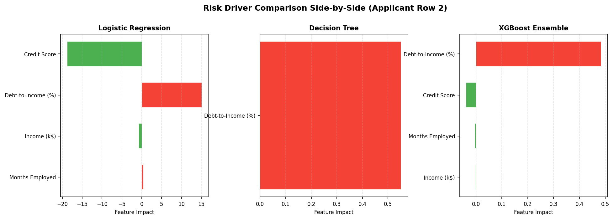
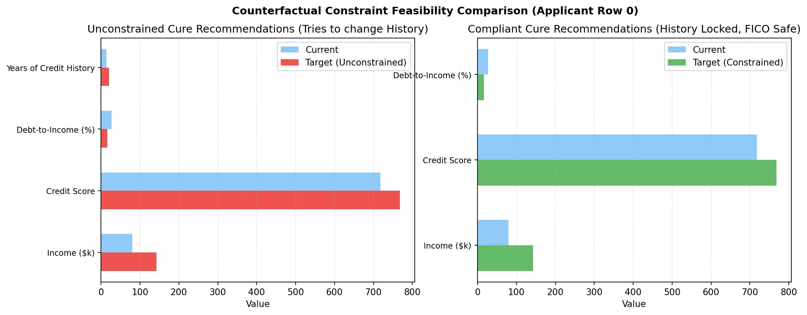

<p align="center">
  
</p>

<h1 align="center">mlxplain</h1>

<p align="center">
  <strong>Turn any ML model into a compliance-ready credit memo — in 4 lines of code.</strong>
</p>

<p align="center">
  <a href="https://www.python.org/"></a>
  <a href="https://opensource.org/licenses/MIT"></a>
  <a href="#-supported-models--xai-translators"></a>
  <a href="#-featured-examples-gallery"></a>
</p>

<p align="center">
  🇺🇸 <strong>English</strong> • <a href="README_vi.md">🇻🇳 Tiếng Việt</a>
</p>

---

## 🔥 What You Get

**One function call. Multi-pillar professional outputs.** No complex configuration needed.

<p align="center">
  
</p>

### 💻 Standing Out: Premium HTML Risk Dossier
In addition to standard text memos and charts, `mlxplain` generates a fully standalone, **premium glassmorphic HTML Credit Risk Dossier** with inlined high-resolution vector SVGs. This provides a portable, compliance-ready interactive risk dashboard out-of-the-box!

<p align="center">
  
</p>

### 📊 Auto-Generated Diagnostic Charts

Every call to `explain_risk()` produces three publication-ready `matplotlib` figures:

<table>
  <tr>
    <td align="center"><strong>Probability Gauge</strong><br/><em>See the decision at a glance</em></td>
    <td align="center"><strong>Feature Drivers (Waterfall)</strong><br/><em>What pushed the prediction?</em></td>
    <td align="center"><strong>Counterfactual Bars</strong><br/><em>What needs to change?</em></td>
  </tr>
  <tr>
    <td></td>
    <td></td>
    <td></td>
  </tr>
</table>

### 📝 Auto-Generated Credit Underwriting Memo

For declined applicants, **mlxplain** generates a compliance-ready text summary with the decision, probability, ranked risk drivers, and actionable cure paths:

```text
============================================================
CREDIT UNDERWRITING MEMO (XGBoost SHAP / RandomForest XAI)
============================================================
CREDIT DECISION: Declined
Default Probability: 65.7% (threshold: 45.0%)

RISK FACTORS:
  - Derogatory Public Records: 2 (impact: 0.1789)
  - Credit Score (FICO): 612.7 (impact: 0.1597)
  - Debt-to-Income (%): 42.54 (impact: 0.1022)
  - Loan-to-Value Ratio (%): 92.13 (impact: 0.08839)
  - Annual Income ($k): 68.41 (impact: 0.05231)
  - Credit Card Utilization (%): 25.97 (impact: 0.03185)
  - Employment Duration (yrs): 5.625 (impact: 0.005195)
  - Open Credit Lines: 6 (impact: 0.001935)
  - Requested Loan Amount ($k): 31.06 (impact: 0.0003766)

MITIGATING FACTORS:
  + Savings Balance ($k): 27.25 (impact: 0.06112)
  + On-Time Payment (%): 99.89 (impact: 0.01372)
  + Years of Credit History: 10.78 (impact: 8.391e-05)

CURE PATHS (changes needed for approval):
  → Derogatory Public Records: decrease from 2 to 0.92
  → Savings Balance ($k): increase from 27.25 to 30.52
  → Credit Card Utilization (%): decrease from 25.97 to 16.62
  → Debt-to-Income (%): decrease from 42.54 to 29.78
  → Loan-to-Value Ratio (%): decrease from 92.13 to 75.54
  → Credit Score (FICO): increase from 612.7 to 686.2
============================================================
```

---

## ⚡ Quick Start (4 Lines)

```python
from mlxplain import explain_risk

report = explain_risk(model, X_train, idx=10, feature_names=FEATURES, threshold=0.45)
print(report.summary)
report.figures["gauge"].savefig("gauge.svg")
```

### 💡 Full Integration Example
If you want to see a full, working script including model training and complete visualization exports:

```python
from sklearn.ensemble import RandomForestClassifier
from mlxplain import explain_risk

# 1. Fit your standard ML model (e.g. 12-feature credit scoring model)
model = RandomForestClassifier().fit(X_train, y_train)

# 2. Define the comprehensive feature names
feature_names = [
    "Annual Income ($k)", "Debt-to-Income (%)", "Credit Score (FICO)",
    "Employment Duration (yrs)", "Savings Balance ($k)", "Requested Loan Amount ($k)",
    "Loan-to-Value Ratio (%)", "Open Credit Lines", "On-Time Payment (%)",
    "Derogatory Public Records", "Credit Card Utilization (%)", "Years of Credit History"
]

# 3. Generate visual & compliance explanation report in 1 call!
report = explain_risk(model, X_train, idx=10, feature_names=feature_names, threshold=0.45)

# 4. Print the professional credit underwriting memo
print(report.summary)

# 5. Save vector SVG diagnostic charts
report.figures["gauge"].savefig("gauge.svg")
report.figures["drivers"].savefig("drivers.svg")
report.figures["counterfactuals"].savefig("counterfactuals.svg")
```

---

## ⚙️ Conventions & Policy

### Threshold & Direction Semantics
- **Decision Rule:** Predictions with `probability >= threshold` receive the `positive_label`; predictions with `probability < threshold` receive the `negative_label`.
- **Driver Direction:** A **positive driver** pushes the prediction toward the `positive_label` (e.g. increases rủi ro/anomalous behavior/cluster assignment). A **negative driver** mitigates/pushes toward the `negative_label`.
  - *Credit Risk:* `positive_label` = **Declined**, `negative_label` = **Approved**. A positive driver means it *increases* default risk (pushes toward decline).
  - *Fraud Triage:* `positive_label` = **Fraud/Review**, `negative_label` = **Clean**.
  - *Anomaly Detection:* `positive_label` = **Anomaly**, `negative_label` = **Normal**.

### Categorical Feature Policy
- **Continuous Default:** Currently, all features are treated as continuous.
- **Upstream Handling:** One-hot or ordinal-encode categorical features upstream before calling `explain()`.
- **Roadmap:** Native discrete categorical counterfactual swaps and visualizations will be supported in version `v0.2.0`.

---


## 💻 Supported Models & XAI Translators

**mlxplain** works across the most popular model families with zero configuration changes:

| Model Family | XAI Extraction Method | Counterfactual Strategy |
| :--- | :--- | :--- |
| **Logistic Regression** | Coefficient weights × feature values | **Analytical:** Mathematical exact-solution inversion |
| **Decision Trees & Random Forests** | Split-level class probability differences along decision paths | **Perturbation:** Iterative split-boundary space search |
| **Ensemble Boosting** *(XGBoost & LightGBM)* | SHAP (Shapley Additive exPlanations) values | **Perturbation:** Sample-bounded boundary search |
| **Anomaly Detection** *(Isolation Forest)* | SHAP `TreeExplainer` on isolation trees | **Perturbation:** Iterative score boundary search |
| **Clustering** *(K-Means)* | Spatial distance differences vs target centroid | **Analytical:** Exact L2 half-space mathematical projection |
| **Deep Learning** *(Neural Nets)* | LIME / Integrated Gradients | *(Planned / Deferred)* |

### Charts Across All Model Types

<table>
  <tr>
    <th></th>
    <th align="center">Logistic Regression</th>
    <th align="center">Decision Tree</th>
    <th align="center">XGBoost (SHAP)</th>
  </tr>
  <tr>
    <td><strong>Feature Drivers</strong></td>
    <td></td>
    <td></td>
    <td></td>
  </tr>
</table>

---

## 🎯 Core Capabilities

For any supported binary classification model, **mlxplain** delivers three pillars of explanation:

* **The Decision:** Classifies the prediction into a clear label (e.g., *Approved/Declined*) based on a configurable threshold.
* **The Drivers:** Identifies and ranks which features pushed the prediction in each direction, sorted independently by mathematical impact.
* **The Counterfactuals:** For unfavorable outcomes, calculates the exact minimum feature adjustments required to cross the threshold (e.g., *"Reduce loan amount by $5,000"*).
* **Smart Performance:** Counterfactuals are only computed for unfavorable predictions (probability ≥ threshold) to save CPU cycles on favorable decisions.

---

## 🧩 Pluggable Domain Architecture

The core of **mlxplain** is model-aware but completely business-agnostic. It separates **what the model saw** from **what it means in business terms**:

```
mlxplain/
├── core/              # Data structures, threshold logic, counterfactuals
├── translators/       # Model-specific feature extraction (domain-agnostic)
├── visualizations/    # Standard matplotlib figures
├── domains/           # Pluggable business interpreters
│   └── credit_risk/   # Credit-specific: Approved/Declined, Risk Factors, Cure Paths
└── engine.py          # Unified API entrypoint
```

To support a new domain (e.g., `healthcare` or `fraud_detection`), you simply create a new domain interpreter subclassing `BaseDomain`. **The translators, math engines, and charting code remain 100% untouched.**

### 🏦 Credit Risk Domain Mapping
The credit risk domain interpreter maps mathematical abstractions into commercial banking terminology:

| Mathematical Concept | Credit Risk Business Term |
| :--- | :--- |
| Positive Prediction | **Declined** (High default probability) |
| Negative Prediction | **Approved** (Low default probability) |
| Positive Drivers | **Risk Factors** (Model weaknesses) |
| Negative Drivers | **Mitigating Factors** (Model strengths) |
| Counterfactuals | **Cure Paths** (Required adjustments for approval) |

---

## 🖥️ Command-Line Interface (CLI)

**mlxplain** features an advanced, standard-library-based CLI tool `mlxplain` to generate reports, print colored terminal dashboards, and export files with zero python code!

### Usage Syntax
```bash
mlxplain explain --model model.pkl --data features.csv --idx 0 [options]
```

### Options & Parameter Mapping
* `--model`: Path to a pickled or `joblib` trained model.
  * *Security notice*: Prints a clear runtime warning about arbitrary code execution in untrusted files.
* `--data`: Path to a CSV file containing your feature rows. Columns are automatically parsed (headers are auto-detected!).
* `--idx`: Zero-based row index to explain (default: `0`).
* `--threshold`: Classification decision boundary (default: `0.5`).
* `--output`: Optional file path to write results (HTML or JSON).
* `--format`: Output format, choosing from:
  * `text`: Gorgeous ANSI-colored terminal dashboard displaying a decision progress bar, colored driver impact scales, and a counterfactual checkbox list.
  * `json`: Structured, machine-readable JSON representation of prediction scores, sorted drivers, and cure paths.
  * `memo`: Raw, unformatted business underwriting/credit memo text.
  * `html`: High-DPI single-file HTML report.
* `--domain`: Business domain routing, e.g. `credit_risk` maps to `explain_risk()` metrics.
* `--language`: Translation selection, choosing from `en` (English) or `vi` (Vietnamese).
* `--immutable`: Comma-separated list of immutable feature names (e.g. `--immutable "Age,History"`).
* `--bounds`: High-precision feature constraints, passed as a raw JSON string (e.g. `--bounds '{"Income": [10000, 50000]}'`) or a JSON file path.

---

## 📊 Interactive Dashboards & Premium HTML Dossier

### 1. Dynamic Plotly Dashboards
In addition to static matplotlib charts, you can generate fully interactive Plotly equivalents:
* **Interactive Gauge**: Displays decision boundaries with dynamic arcs and markers.
* **Feature Driver Waterfall**: Allows hovering to inspect exact attribution margins.
* **Grouped Counterfactuals**: Interactive grouping to easily compare current vs required values.
* **Per-Class Heatmap**: Divergent color scales showing class contributions dynamically.

To generate these interactive Plotly figures, simply call:
```python
from mlxplain.visualizations.plotly_charts import plot_report_plotly

# Returns a dictionary of Plotly Figure objects: gauge, drivers, counterfactuals, heatmap
plotly_figures = plot_report_plotly(report)
```

### 2. Single-File HTML Reports (`export_html`)
Compile the complete explanation report into a self-contained, high-DPI HTML report suitable for compliance, triage audits, or emailing to underwriters:
* Embeds all matplotlib figures natively as Base64-encoded PNG strings.
* Optionally incorporates active interactive Plotly graphs using a single CDN library script in the header.
* Features a responsive CSS design (supporting dark/light preferences), glassmorphism card containers, and clean Outfit/Inter Google typography.
* **Print-Ready**: Configured with CSS print viewports for high-fidelity browser print-to-PDF ("Save as PDF").

```python
from mlxplain.core.exporter import export_html

# Exports the report directly as a premium single-file HTML dashboard
export_html(report, "dossier.html", include_plotly=True)
```

---

## 🎨 Featured Examples Gallery

**mlxplain** is accompanied by 10 comprehensive, ready-to-run examples demonstrating standard business scenarios, mathematical paradigms, and premium visualizations.

### 📊 Highlighted Showcases

<table>
  <tr>
    <td align="center"><strong>Multi-Model Comparison Grid</strong><br/><em>(Example 08: Side-by-side consistency verification)</em></td>
    <td align="center"><strong>Constrained Compliance Counterfactuals</strong><br/><em>(Example 09: Locked histories & FICO limits)</em></td>
  </tr>
  <tr>
    <td></td>
    <td></td>
  </tr>
</table>

### 📂 Directory of Runnable Examples

| Example Script | Business Domain | Key XAI Capability Showcased | Optional Deps |
| :--- | :--- | :--- | :--- |
| [01_logistic_credit_risk.py](examples/01_logistic_credit_risk.py) | Credit Underwriting | Logistic Regression exact analytical counterfactual cure paths | None |
| [02_decision_tree_credit_risk.py](examples/02_decision_tree_credit_risk.py) | Credit Underwriting | Split-level decision tree path probability contributions | None |
| [03_ensemble_credit_risk.py](examples/03_ensemble_credit_risk.py) | Credit Underwriting | XGBoost / LightGBM game-theoretic SHAP driver attributions | `xgboost`, `shap` |
| [04_advanced_credit_risk.py](examples/04_advanced_credit_risk.py) | Credit Underwriting | 12-feature high-DPI glassmorphic HTML dossier compiler | `xgboost` (opt) |
| [05_anomaly_detection.py](examples/05_anomaly_detection.py) | Server IT Operations | Isolation Forest anomaly score normalization & DDoS spike drivers | `shap` |
| [06_kmeans_clustering.py](examples/06_kmeans_clustering.py) | Retail Marketing | KMeans customer segments spatial centroid L2 counterfactual roadmap | None |
| [07_multiclass_credit_grading.py](examples/07_multiclass_credit_grading.py) | Credit Underwriting | Multinomial multi-class credit grading with Vietnamese localization | None |
| [08_model_comparison.py](examples/08_model_comparison.py) | Underwriting Compliance | Stitched multi-model waterfall driver consistency comparison | `xgboost` (opt) |
| [09_constrained_counterfactuals.py](examples/09_constrained_counterfactuals.py) | Compliance / Safety | Safety bounds and immutable years history constraints | None |
| [10_plotly_dashboards.py](examples/10_plotly_dashboards.py) | Web Risk Triage | Premium interactive Plotly widgets & dynamic HTML exports | `plotly` |

---

## 🚀 Runnable Examples

The `examples/` directory contains complete, runnable scripts showing **mlxplain** end-to-end. They generate synthetic credit data, train models, produce reports, and save diagnostic plots.

Run them directly using `uv`:

```bash
# 1. Run the Logistic Regression Credit Risk example
uv run python examples/01_logistic_credit_risk.py

# 2. Run the Decision Tree Credit Risk example
uv run python examples/02_decision_tree_credit_risk.py

# 3. Run the XGBoost SHAP-based Credit Risk example
uv run python examples/03_ensemble_credit_risk.py

# 4. Run the Advanced 12-Feature HTML Dossier Credit Risk example
uv run python examples/04_advanced_credit_risk.py

# 5. Run the Unsupervised Anomaly Detection example
uv run python examples/05_anomaly_detection.py

# 6. Run the Unsupervised KMeans Customer Segmentation example
uv run python examples/06_kmeans_clustering.py

# 7. Run the Localized Multi-Class Credit Grading example
uv run python examples/07_multiclass_credit_grading.py

# 8. Run the Side-by-Side Model Comparison example
uv run python examples/08_model_comparison.py

# 9. Run the Constrained Compliant Counterfactuals example
uv run python examples/09_constrained_counterfactuals.py

# 10. Run the Premium Interactive Plotly Dashboards example
uv run python examples/10_plotly_dashboards.py
```

All examples save their generated plots to `examples/output/`. The advanced example also creates `dossier.html` in that directory — open it in your browser to view the interactive glassmorphic dashboard!

---

## 🌀 Unsupervised Model Explainability

**mlxplain** is the first general-purpose explainability engine to unify supervised classification with **unsupervised learning XAI** (Anomaly Detection & Clustering) under the exact same visual and structured output reporting standards!

### 1. Anomaly Detection (via `IsolationForest`)
* **Standardized Anomaly Scoring**: We normalize scikit-learn's Isolation Forest anomaly scores into $[0, 1]$, treating it exactly like a probability with a standard `0.5` decision boundary. Accessible via the unified `explain()` API.
* **SHAP Drivers**: Uses SHAP's `TreeExplainer` on isolation trees to extract exact features pushing the instance into anomalous vs normal states.
* **Cure Counterfactuals**: Employs sample-bounded perturbation search to identify the exact feature changes needed to restore the anomalous system to normal behavior.

### 2. Clustering (via `KMeans`)
* **Dedicated Endpoint**: Introduces `explain_cluster()` to explain K-Means cluster assignments vs runner-up or target clusters.
* **Distance Drivers**: Measures how much each feature contributes to keeping the instance closer to the assigned centroid $c$ rather than the competitor centroid $t$:
  $$\text{impact}_i = (x_i - t_i)^2 - (x_i - c_i)^2$$
* **Closed-Form Upgrade Roadmap**: Utilizes a highly robust, exact **L2 mathematical projection** to calculate the absolute minimum single/multi-feature changes needed to transition the instance to a target cluster *instantly* with zero loops!
* **Cluster Gauge Score**: Normalizes Euclidean distance vectors into a $[0, 1]$ proximity score ($p = d_t^2 / (d_c^2 + d_t^2)$) to reuse the standard gauge visualization.

---

## 🔠 Multi-Class Classification Explainability (Grades & Tiers)

**mlxplain** provides native support for multi-class classification models, extending unified feature impact tracking and counterfactual cure paths beyond simple binary decisions:

* **Argmax Prediction & Runner-Up Defaults**: Automatically detects multi-class models, classifies via standard probability argmax, and defaults the counterfactual target to the **runner-up class** (the most likely alternative) if no explicit `target_class` is provided.
* **Premium Heatmap & Probability Charts**: In multi-class mode, `plot_report()` automatically swaps the binary gauge for:
  1. A **Class Probabilities Bar Chart** highlighting the predicted class.
  2. A **Per-Class Feature Impact Heatmap** displaying a rich, divergent representation of feature contributions across all classes.
* **Closed-Form Multinomial Counterfactuals**: Invents exact analytical multinomial logit transformations to solve for the boundary transition $\Delta X_f = \frac{z_{c^*} - z_t}{W_{t, f} - W_{c^*, f}}$ with absolute mathematical precision.
* **Credit Risk Grading & Localized Memos**: Adapts underwriting outputs for risk tiers (A/B/C), generating credit grade memos localized as **"Grade A/B/C"** in English and **"Hạng A/B/C"** in Vietnamese.

---

## 📦 Installation

This project is fully compatible with [uv](https://github.com/astral-sh/uv) for lightning-fast package management.

### For Users

Install the base package directly into your virtual environment (logistic and tree models work out-of-the-box):

```bash
uv pip install mlxplain-xai
# or using standard pip
pip install mlxplain-xai
```

#### Optional Backends (XGBoost / LightGBM / IsolationForest)
To use ensemble-based explainers or unsupervised anomaly detection, install with the `shap` optional extra:

```bash
pip install mlxplain-xai[shap]
```

#### Interactive Dashboards Backend (Plotly)
To generate dynamic Plotly-based interactive dashboards alongside matplotlib, install with the `plotly` extra:

```bash
pip install mlxplain-xai[plotly]
```

> [!NOTE]
> **Upgrading from 0.1.x?** `shap` is now an optional dependency in `v0.2.0` to reduce startup import overhead. If your code uses XGBoost, LightGBM, or IsolationForest, please make sure to install/upgrade using `pip install mlxplain-xai[shap]`. See [CHANGELOG.md](file:///Users/thinhnguyen/Documents/GitHub/mlxplain/CHANGELOG.md) for full details.

Or install the locked development dependencies:

```bash
pip install -r requirements.txt
pip install -e .
```

### For Developers

Set up the project locally for development:

1. Clone the repository:
   ```bash
   git clone https://github.com/nguyen-thinh15/mlxplain.git
   cd mlxplain
   ```
2. Create and synchronize the environment:
   ```bash
   uv venv --python 3.10
   source .venv/bin/activate
   uv sync --all-extras
   ```
3. Run the test suite:
   ```bash
   uv run pytest tests/ -v
   ```

**Core Dependencies:** `numpy`, `scikit-learn`, `matplotlib`
**Optional Dependencies:** `shap`, `xgboost`, `lightgbm` (for ensembles), `plotly` (for interactive charts)
